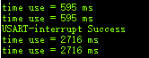

# STM32_Template
 STM32_CubeMX_inPlatformIO

## 1 日志

 * @外设相关：stm单片机

   @版本：1.1

   @维护：Tony_Wang

   @代码规范：暂无
   
    
   
  
   | 版本                               |                 更新时间                  |                             功能                             |
   | :--------------------------------- | :---------------------------------------: | :----------------------------------------------------------: |
   | 1.0 |   2023-7   | 完成构建F1和F4在pio上节后cubemx实现编译烧录和调试 |
   | 1.1 | 2023-11-10 | 完善编译优化，cpp混合编译，硬件fpu加速等ini配置更新 |
   |                                    |                                           |                                                              |
   |                                    |                                           |                                                              |
   |                                    |                                           |                                                              |

## 2 使用方法

* 目前已经将工程文件打包并拷贝至新电脑或新地方
* 安装 vscode 和 pio 插件
* 直接运行编译，将会自动下载相关编译工具链等

## 3 其余说明

* 所有文件名和路径要严格对应
* cubemx生成的文件全部在cubemx文件夹中
* pio调用的是整个工程目录下的ini编译文件，其余Makefile是没有作用的，只会根据ini进入gcc的编译
* update_link_flags.py 是 ini 的一个额外链接文件，用于完成 硬件fpu 加速的编译工作，且fpu加速后效果明显，以下是 f4rgt6 运行 2M次float运算所花费的时间对比，F1使用的时候要在ini中注释掉 

